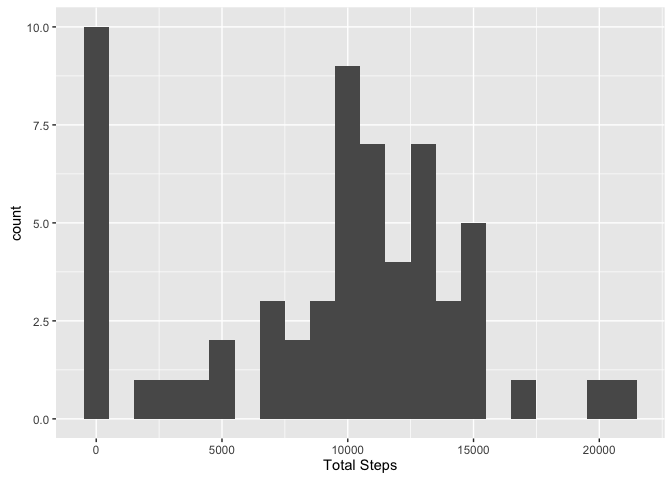
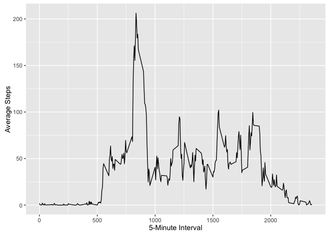
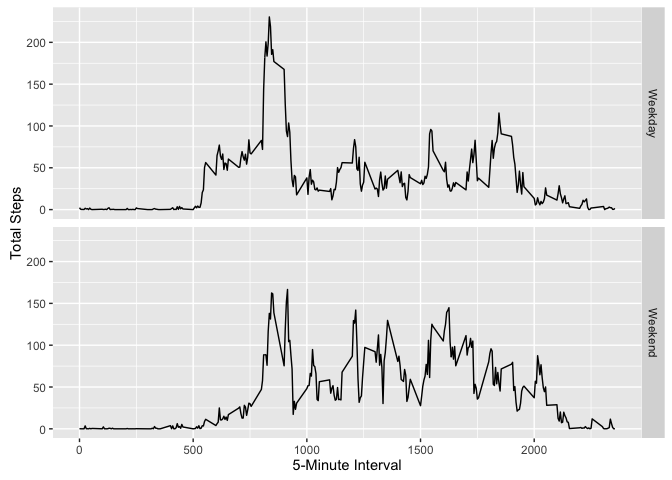

# Project 1
August 6, 2016  


Load Libraries (run in console and comment out here) 

```r
#library(knitr)
#library(dplyr)
#library(lubridate) 
#library(ggplot2)
```

Read CSV

```r
path = "/Users/crusanton/Documents/COURSERA/5 - Reproducible Research/Project 1/activity.csv"
ActivityOriginal <- read.csv(path, header = TRUE, sep = ',', colClasses = c("numeric", "character", "integer"))
```

View data  

```r
head(ActivityOriginal)
```

```
##   steps       date interval
## 1    NA 2012-10-01        0
## 2    NA 2012-10-01        5
## 3    NA 2012-10-01       10
## 4    NA 2012-10-01       15
## 5    NA 2012-10-01       20
## 6    NA 2012-10-01       25
```

### What is mean total number of steps taken per day? 
1. Make a histogram of the total number of steps taken each day

```r
library(ggplot2)   # needs to be reloaded here
TotalSteps <- tapply(ActivityOriginal$steps, ActivityOriginal$date, FUN=sum, na.rm=TRUE)  
qplot(TotalSteps, binwidth=1000, xlab="Total Steps")
```

<!-- -->
2. Calculate and report the mean and median total number of steps taken per day

```r
mean(TotalSteps, na.rm=TRUE)
```

```
## [1] 9354.23
```

```r
median(TotalSteps, na.rm=TRUE)
```

```
## [1] 10395
```

### What is the average daily activity pattern?   
Calculate average

```r
AverageSteps <- aggregate(x=list(steps=ActivityOriginal$steps), by=list(interval=ActivityOriginal$interval), FUN=mean, na.rm=TRUE)
```
1. Make a time series plot (i.e. type = "l") of the 5-minute interval (x-axis) and the average number of steps taken, averaged across all days (y-axis)

```r
ggplot(data=AverageSteps, aes(x=interval, y=steps)) + geom_line() + xlab("5-Minute Interval") + ylab("Average Steps")
```

<!-- -->

2. Which 5-minute interval, on average across all the days in the dataset, contains the maximum number of steps?

```r
AverageSteps[which.max(AverageSteps$steps),]
```

```
##     interval    steps
## 104      835 206.1698
```

### Imputing missing values
1. Calculate and report the total number of missing values in the dataset (NA records)

```r
sum(is.na(ActivityOriginal$steps))
```

```
## [1] 2304
```

2. Devise a strategy for filling in all of the missing values (create a function)

```r
FillAverage <- function(steps, interval) {
    filled <- NA
    if (!is.na(steps))
        Filled <- c(steps)
    else
        Filled <- (AverageSteps[AverageSteps$interval==interval, "steps"])
    return(Filled)
}
```

3. Create a new dataset that is equal to the original dataset but with the missing data filled in.

```r
Filled <- ActivityOriginal
Filled$steps <- mapply(FillAverage, Filled$steps, Filled$interval)
```

4. Make a histogram of the total number steps taken each day and Calculate and report the mean and total number of steps taken per day. Do these values differ from the estimates from the first part of the assignment? What is the impact of imputing missing data on the estimates of the total daily number of steps?


```r
TotalSteps <- tapply(Filled$steps, Filled$date, FUN=sum)
qplot(TotalSteps, binwidth=1000, xlab="Total Steps", ylab="5-Minute Interval")
```

<!-- -->

```r
mean(TotalSteps)
```

```
## [1] 10766.19
```

```r
median(TotalSteps)
```

```
## [1] 10766.19
```
Mean/median are higher with inputted data because when using NAs, it defaults to zero for those values.

### Are there differences in activity patterns between weekdays and weekends?
1. Create a new factor variable in the dataset with two levels -- "weekday" and "weekend" indicating whether a given date is a weekday or weekend day.

```r
WeekEndDay <- function(date) {
    day <- weekdays(date)
    if (day %in% c("Monday", "Tuesday", "Wednesday", "Thursday", "Friday"))
        return("Weekday")
    else if (day %in% c("Saturday", "Sunday"))
        return("Weekend")
}
Filled$date <- as.Date(Filled$date)
Filled$day <- sapply(Filled$date, FUN=WeekEndDay)
```

2. Make a panel plot containing a time series plot (i.e. tpye - "l") of the 5-minute interval (x-axis_ and the average number of steps taken, averaged across all weekday days or weekend days (y-axis).

```r
AverageSteps <- aggregate(steps ~ interval + day, data=Filled, mean)
ggplot(AverageSteps, aes(interval, steps)) + geom_line() + facet_grid(day ~ .) + xlab("5-Minute Interval") + ylab("Total Steps")
```

<!-- -->

Summary: It looks as though the participants were more active on weekends.
